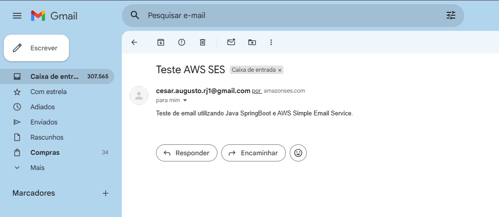
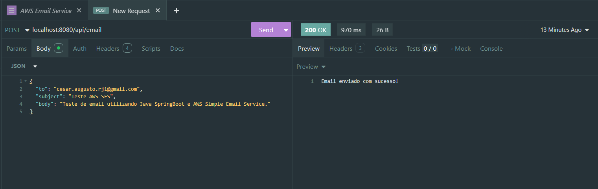

# Email Service - AWS SES

Microserviço para envio de emails utilizando **Amazon Simple Email Service (SES)** desenvolvido com **Spring Boot** seguindo os princípios de **Clean Architecture**.

## 📋 Sobre o Projeto

Este é um projeto de estudos para prática com **AWS SES** e implementação de uma arquitetura limpa e desacoplada. O serviço expõe uma API REST para envio de emails através da infraestrutura da Amazon.

## 🏗️ Arquitetura

O projeto segue os princípios da **Clean Architecture**, organizando o código em camadas bem definidas:

```
src/main/java/br/com/sistema/emailservice/
│
├── core/                          # Camada de Domínio (Regras de Negócio)
│   ├── EmailRequest.java          # DTO de requisição
│   ├── EmailSenderUseCase.java    # Contrato do caso de uso
│   └── exceptions/
│       └── EmailServiceException.java
│
├── application/                   # Camada de Aplicação (Casos de Uso)
│   └── EmailSenderService.java    # Implementação do caso de uso
│
├── adapters/                      # Camada de Adaptadores (Interfaces)
│   └── EmailSenderGateway.java    # Interface do gateway de email
│
├── infra/                         # Camada de Infraestrutura (Implementações)
│   └── ses/
│       ├── AwsSesConfig.java      # Configuração do cliente AWS SES
│       └── SesEmailSender.java    # Implementação do gateway com SES
│
├── controllers/                   # Camada de Apresentação (API REST)
│   └── EmailSenderController.java
│
└── Startup.java                   # Classe principal do Spring Boot
```

### Benefícios da Arquitetura

- **Desacoplamento**: A lógica de negócio não depende de frameworks ou bibliotecas externas
- **Testabilidade**: Fácil criação de testes unitários e de integração
- **Manutenibilidade**: Código organizado e de fácil compreensão
- **Flexibilidade**: Troca de provedores de email (SES, SendGrid, etc.) sem impactar o core

## 🚀 Tecnologias Utilizadas

- **Java 21**
- **Spring Boot 3.5.8**
- **AWS SDK for Java** (Amazon SES)
- **Maven**

## ⚙️ Configuração

### 1. Credenciais AWS

Edite o arquivo `src/main/resources/application.properties`:

```properties
aws.accessKeyId=SUA_ACCESS_KEY_AQUI
aws.secretKey=SUA_SECRET_KEY_AQUI
aws.region=sa-east-1
```

### 2. Email Remetente

No arquivo `SesEmailSender.java`, configure o email remetente verificado no SES:

```java
.withSource("seu-email-verificado@exemplo.com")
```

## 🔧 Instalação e Execução

### Clone o repositório

```bash
git clone https://github.com/seu-usuario/email-service.git
cd email-service
```

### Compile o projeto

```bash
mvn clean install
```

### Execute a aplicação

```bash
mvn spring-boot:run
```

A aplicação estará disponível em: `http://localhost:8080`

## 📡 Endpoints da API

### Enviar Email

**POST** `/api/email`

**Request Body:**
```json
{
  "to": "destinatario@exemplo.com",
  "subject": "Assunto do Email",
  "body": "Corpo do email em texto simples"
}
```

**Response Sucesso (200 OK):**
```
Email enviado com sucesso!
```



**Response Erro (500 Internal Server Error):**
```
Erro enquanto enviava o email.
```

### Exemplo com cURL

```bash
curl -X POST http://localhost:8080/api/email \
  -H "Content-Type: application/json" \
  -d '{
    "to": "destinatario@exemplo.com",
    "subject": "Teste",
    "body": "Este é um email de teste"
  }'
```

### Exemplo com Postman/Insomnia

```
Method: POST
URL: http://localhost:8080/api/email
Headers:
  Content-Type: application/json
Body (raw JSON):
{
  "to": "destinatario@exemplo.com",
  "subject": "Email de Teste",
  "body": "Conteúdo do email"
}
```



## 📚 Estrutura de Classes

### Core (Domínio)

- **EmailRequest**: Record que representa a requisição de envio de email
- **EmailSenderUseCase**: Interface que define o contrato do caso de uso
- **EmailServiceException**: Exceção customizada para erros no serviço

### Application

- **EmailSenderService**: Implementa a lógica de negócio para envio de emails

### Adapters

- **EmailSenderGateway**: Interface que abstrai o provedor de email (permite trocar SES por outro serviço)

### Infrastructure

- **AwsSesConfig**: Configuração do cliente AWS SES com credenciais
- **SesEmailSender**: Implementação concreta usando AWS SES

### Controllers

- **EmailSenderController**: Expõe o endpoint REST para envio de emails

## 🔒 Boas Práticas de Segurança

1. **Nunca commite credenciais** no código
2. Use **variáveis de ambiente** para dados sensíveis:
   ```bash
   export AWS_ACCESS_KEY_ID=sua_access_key
   export AWS_SECRET_ACCESS_KEY=sua_secret_key
   ```
3. Em produção, utilize **IAM Roles** em vez de credenciais estáticas
4. Implemente **rate limiting** para evitar abuso da API
5. Adicione **validação de entrada** nos dados recebidos

## 🧪 Melhorias Futuras

- [ ] Adicionar documentação com Swagger
- [ ] Adicionar validação de emails com Bean Validation
- [ ] Suportar envio de emails HTML
- [ ] Adicionar suporte para anexos
- [ ] Implementar fila de emails com Amazon SQS
- [ ] Adicionar logs estruturados
- [ ] Adicionar autenticação e autorização na API
- [ ] Criar templates de email

---

⭐ Se este projeto foi útil para você, considere dar uma estrela no repositório!
